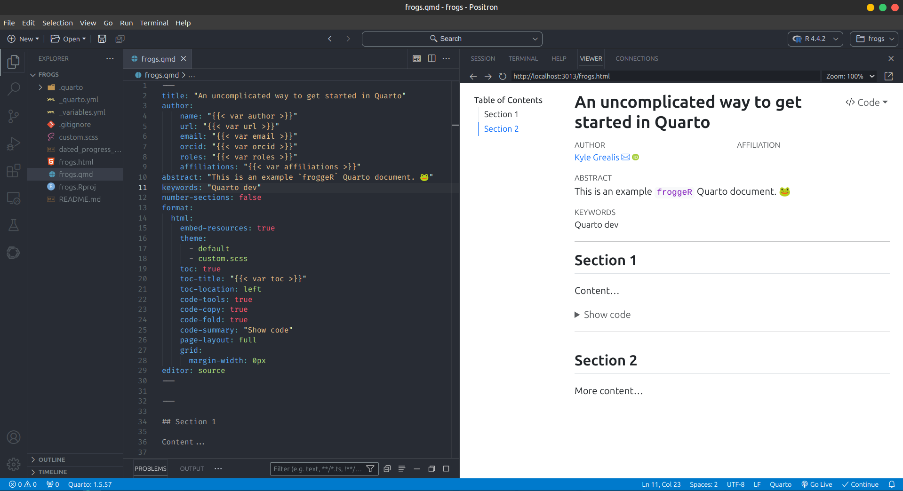

# froggeR 

[](https://github.com/kyleGrealis/froggeR)
[](https://lifecycle.r-lib.org/articles/stages.html#maturing)
[](https://CRAN.R-project.org/package=froggeR)
[](https://cran.r-project.org/package=froggeR)

## Why froggeR?

> Leap ahead in your data science journey with froggeR! Streamline Quarto workflows, create structured projects, and enhance collaboration with ease. 🐸

froggeR simplifies project setup so you can focus on what matters:

* **Efficiency**: Minimize setup time, maximize analysis time
* **Consistency**: Uniform styling and structure across all your projects
* **Reliability**: Prevent common setup issues before they occur
* **Security**: Robust `.gitignore` settings for enhanced data protection
* **Collaboration**: Structured documentation for seamless team onboarding

----

## Who's it for?

froggeR is ideal for R users who:

* Manage multiple Quarto projects
* Collaborate in team environments
* Prioritize analysis over setup complexities
* Need rapid project initialization

----

<p align="center">
  
</p>

----

## Installation

```r
# Install from CRAN... COMING SOON!
# install.packages("froggeR")

# Or get the development version
remotes::install_github('kyleGrealis/froggeR@dev')
```

----

### 🎯 Streamlined Quarto Project Creation

Initialize a comprehensive Quarto project with a single command:

```r
froggeR::quarto_project(
  name = "my_new_project",
  custom_yaml = TRUE  # Use custom YAML from _variables.yml
)
```

This creates:
* A Quarto document with custom YAML
* A comprehensive `.gitignore`
* A structured `README.md`
* A reusable `_variables.yml`
* A `custom.scss` style sheet template
* An RStudio project file (`.Rproj`)

### 🔄 Centralized Settings Management

Maintain consistent metadata across your documents:

```r
froggeR::froggeR_settings()
```

Interactively create or update `_variables.yml` with:
* Author details
* Contact information
* Affiliations
* Project metadata
* Document preferences

### 📝 Templated Quarto Documents

Generate new Quarto documents with pre-formatted headers:

```r
froggeR::write_quarto(
  filename = "analysis",
  custom_yaml = TRUE  # Use variables from _variables.yml
)
```
```

### 🛡️ Enhanced Git Protection

Set up a comprehensive `.gitignore` for R projects:

```r
froggeR::write_ignore()
```

Automatically excludes:
* R data files (`.RData`, `.rda`, `.rds`)
* Common data formats (CSV, Excel, text files)
* Sensitive information

### 🌟 Custom Styling Made Easy

Generate a SCSS template for custom document styling:

```r
froggeR::write_scss()
```

Provides a formatted stylesheet with:
* SCSS defaults
* SCSS mixins
* SCSS rules

Customize your document's appearance by uncommenting desired styles.

### 📚 Automated Project Documentation

Generate a structured README for your project:

```r
froggeR::write_readme()
```

Includes sections for:
* Project overview
* Setup instructions
* File and directory explanations
* Contribution guidelines

----

## Function Reference

| Function | Description |
|----------|-------------|
| `froggeR_settings()` | Manage persistent Quarto document settings |
| `quarto_project()` | Initialize a complete Quarto project structure |
| `write_quarto()` | Create consistently formatted Quarto documents |
| `write_ignore()` | Configure `.gitignore` for enhanced data security |
| `write_readme()` | Generate a comprehensive project README |
| `write_scss()` | Create a customizable SCSS styling template |

----

## Contributing

We welcome contributions! For major changes, please open an issue first to discuss your ideas.

----

## License

[MIT](https://choosealicense.com/licenses/mit/)

---

Developed by [Kyle Grealis](https://github.com/kyleGrealis)
