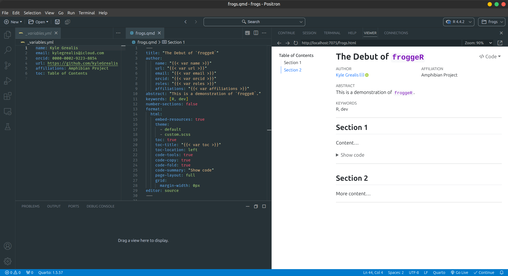

# froggeR 


[](https://github.com/kyleGrealis/froggeR)
[](https://lifecycle.r-lib.org/articles/stages.html#maturing)
[](https://CRAN.R-project.org/package=froggeR)
[](https://cran.r-project.org/package=froggeR)

> froggeR version: 0.5.2

froggeR is an R package designed to streamline the creation and management of Quarto projects. It provides a suite of tools to automate setup, ensure consistency, and enhance collaboration in data science workflows.

## Why froggeR?

> Leap ahead in your data science journey with froggeR! Streamline Quarto workflows, create structured projects, and enhance collaboration with ease. 🐸

froggeR simplifies project setup so you can focus on what matters:

* **Efficiency**: Minimize setup time, maximize analysis time
* **Consistency**: Uniform styling and structure across all your projects
* **Reliability**: Prevent common setup issues before they occur
* **Security**: Robust `.gitignore` settings for enhanced data protection
* **Collaboration**: Structured documentation for seamless team onboarding
* **Customization**: Easy-to-use tools for tailoring project aesthetics
* **Reproducibility**: Ensure consistent environments across team members

----

## Key Features

* One-command Quarto project initialization
* Centralized settings management for consistent metadata
* Quickly create, save, and reuse metadata & Quarto branding
* Automated creation of essential project files (README, .gitignore, etc.)
* Custom YAML and SCSS templating for unique document styling
* Interactive setup process for user-specific configurations

----

## Getting Started

Install froggeR and create your first project in minutes:

```r
# Install from CRAN... JUST APPROVED Jan. 15!
install.packages("froggeR")

# Or get the development version
remotes::install_github('kyleGrealis/froggeR')

# Create your first froggeR project
froggeR::quarto_project('frogs')
```
----

## Who's it for?

froggeR is ideal for R users who:

* Manage multiple Quarto projects
* Find themselves rewriting the same YAML & project structure repeatedly
* Collaborate in team environments
* Prioritize analysis over setup complexities
* Need rapid project initialization

----

<p align="center">
  
</p>
<p align="center"><i>Example of a rendered Quarto document created with froggeR</i></p>


----

### 🎯 Streamlined Quarto Project Creation

Initialize a comprehensive Quarto project with a single command:

```r
froggeR::quarto_project(name = 'my_new_project')
```

This creates:

* A Quarto document with custom YAML
* A comprehensive `.gitignore`
* Structured `README.md` & progress notes templates
* Reusable `_variables.yml` & `_brand.yml` files
* A `custom.scss` style sheet template
* A `references.bib` for citations

### 🔄 Centralized Settings Management

Maintain consistent metadata across your documents:

```r
froggeR::settings()
```

Interactively create or update metadata that is reusable across Quarto projects & 
documents with:

* Author details
* Contact information
* Affiliations
* Project metadata
* Document preferences

### 📝 Templated Quarto Documents

Quickly generate new Quarto documents with pre-formatted headers:

```r
froggeR::write_quarto(
  filename = 'data_cleaning',
  example = TRUE  # Add tool templates
)
```

### 🛡️ Enhanced Git Protection

Set up a comprehensive `.gitignore` for R projects:

```r
froggeR::write_ignore()
```

Automatically excludes:

* R data files (`.RData`, `.rda`, `.rds`)
* Common data formats (CSV, Excel, text files)
* Sensitive information

### 🌟 Custom Styling Made Easy

Generate a SCSS template for custom document styling:

```r
froggeR::write_scss()
```

Provides a formatted stylesheet with:

* SCSS defaults
* SCSS mixins
* SCSS rules

Customize your document's appearance by uncommenting desired styles.

### 📚 Automated Project Documentation

Generate a structured README for your project:

```r
froggeR::write_readme()
```

Includes sections for:

* Project overview
* Setup instructions
* File and directory explanations
* Contribution guidelines

----

## Comparison with Other Tools

While there are other project management tools for R, froggeR stands out by:

* Focusing specifically on Quarto workflows
* Providing a balance between automation and customization
* Offering a comprehensive suite of tools in a single package
* Emphasizing reproducibility and collaboration

----

We're constantly improving froggeR. Upcoming features include:

* Quarto dashboard integration
* Integration with version control systems
* Enhanced team collaboration tools
* More customizable templates for various data science workflows

----

## Function Reference

| Function | Description |
|----------|-------------|
| `settings()` | Manage persistent Quarto document metadata |
|  `quarto_project()` | Initialize a complete Quarto project structure |
| `write_quarto()`\* | Create consistently formatted Quarto documents |
| `write_variables()`\* | Re-use metadata across projects & documents |
| `save_variables()` | Save current `_variables.yml` to system-level configs |
| `save_brand()` | Save current `_brand.yml` to system-level configs |
| `write_brand()` | Create project-level `_brand.yml` configs |
| `write_ignore()`\* | Configure `.gitignore` for enhanced data security |
| `write_readme()`\* | Generate a comprehensive project README |
| `write_notes()`\* | Create a dated progress notes template |
| `write_scss()`\* | Create a customizable SCSS styling template |
\* *These functions are included with `quarto_project()`*

----

## Contributing

We're open to suggestions! If you have ideas for new features, please open an issue on our GitHub repository.

----

## License

[MIT](https://choosealicense.com/licenses/mit/)

---

Developed by [Kyle Grealis](https://github.com/kyleGrealis)
