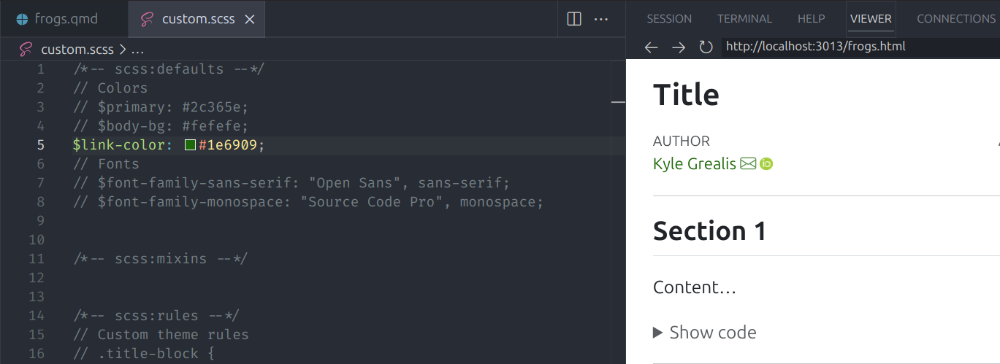

```{r, include = FALSE}
knitr::opts_chunk$set(
  collapse = TRUE,
  comment = "#>"
)
```

## Introduction

One of `froggeR`'s core strengths is its ability to maintain consistent settings and styling across multiple projects. This vignette demonstrates how to set up and customize your Quarto documents using `froggeR`'s SCSS document.

----

## Using Custom Variables in Quarto Documents

froggeR allows you to use variables from your `_variables.yml` file directly in your Quarto documents:

```yaml
---
title: "My Document"
author: ""
date: ""
---
```

This ensures consistency across all your project documents and makes updates easier to manage.

----

## Document Styling with SCSS

### Understanding SCSS Structure

The [`write_scss()`](https://azimuth-project.tech/froggeR/reference/write_scss.html) function creates a template with three main sections:

1. **Defaults** (`/*-- scss:defaults --*/`)
    * Basic styling variables
    * Color schemes
    * Font settings

2. **Mixins** (`/*-- scss:mixins --*/`)
    * Reusable style patterns
    * Custom style functions

3. **Rules** (`/*-- scss:rules --*/`)
    * Specific element styling
    * Custom classes
    * Layout adjustments

### Working with Comments

The SCSS template uses `//` for commented styles. These act like a menu of styling options:

```scss
/*-- scss:defaults --*/
// $primary: #2c365e;          // Main theme color
// $body-bg: #fefefe;          // Background color
// $link-color: $primary;        // Inherit from primary
```

To activate any style:

1. Remove the `//` at the start of the line
2. Save the file
3. Re-render your document

### Working with Multiple SCSS Files

To multiple or a organization-specific SCSS file in your Quarto document, update the YAML header:

```yaml
---
title: "My Document"
format:
  html:
    theme:
      - default
      - custom.scss        # Added during project 
      - your-other.scss    # The new one you're adding
---
```

> **Note**: Order matters! Any style(s) set in `custom.scss` override Quarto's defaults, and `your-other.scss` overrides the previous two. If your document isn't rendering as you believe it should, check the files. If you have a border style set in `custom.scss` but the output file isn't correct, there's a good possibility that there's something set in `your-other.scss` causing conflicts. Resolve the issue and re-render. :)

### Basic Customization Examples

#### Link Color

Here's an example of changing the default link color from the assigned `$primary` color (blue) to dark green.

```{r, echo=FALSE, fig.align='center', fig.cap='Link color styling - Before', out.width='70%'}

```

```scss
/*-- scss:defaults --*/
// These lines are inactive (commented out):
// $link-color: $primary;
```

Remove the `//` to activate and change `$primary` to `#1e6909`:

```scss
$link-color: #1e69090;
```

```{r, echo=FALSE, fig.align='center', fig.cap='Link color styling - After', out.width='70%'}

```

#### Theme Colors

The `custom.scss` template includes common color variables:

```scss
/*-- scss:defaults --*/
$primary: #1a936f;      // Forest green
$body-bg: #f8f9fa;      // Light gray
```

### Advanced Customization

Combine multiple elements for sophisticated styling:

```scss
/*-- scss:defaults --*/
// First, set your variables
$primary: #2c365e;
$font-family-monospace: "Fira Code", monospace;

/*-- scss:rules --*/
// Then create custom rules
.title-block {
  margin-bottom: 2rem;
  border-bottom: 3px solid $primary;
  
  h1 {
    color: darken($primary, 10%);
    font-weight: 600;
  }
}

// Style code elements
code {
  color: lighten($primary, 10%);
  padding: 0.2em 0.4em;
  border-radius: 3px;
}
```

----

## Quick Styling Recipes

### Modern Document Headers

```scss
/*-- scss:rules --*/
.title-block {
  background: linear-gradient(to right, $primary, lighten($primary, 20%));
  padding: 2rem;
  margin-bottom: 3rem;
  color: white;
  border-radius: 5px;
}
```

### Enhanced Code Blocks

```scss
/*-- scss:defaults --*/
$code-block-bg: #f8f9fa;
$font-family-monospace: "Fira Code", monospace;

/*-- scss:rules --*/
pre {
  border-radius: 4px;
  box-shadow: 0 2px 4px rgba(0,0,0,0.1);
  margin: 1.5em 0;
}
```

### Professional Links

```scss
/*-- scss:rules --*/
a:not(.nav-link) {
  border-bottom: 1px dotted $primary;
  text-decoration: none;
  transition: all 0.2s ease;
  
  &:hover {
    border-bottom: 1px solid $primary;
    background-color: rgba($primary, 0.1);
  }
}
```

----

## Common Issues and Solutions

### Settings Issues

1. **Variables Not Updating**
    * Restart R session after `config.yml` changes
    * Check `_variables.yml` exists in project
    * Verify YAML structure in documents

2. **Multiple Projects**
    * Settings apply to new projects only
    * Existing projects keep their settings
    * Update `_variables.yml` manually if needed

----

## Additional Resources

For more advanced SCSS customization options, visit:

* [Quarto HTML Themes](https://quarto.org/docs/output-formats/html-themes.html#customizing-themes){target="_blank"}
* [More Theme Options](https://quarto.org/docs/output-formats/html-themes-more.html){target="_blank"}
* [Bootstrap Variables](https://github.com/twbs/bootstrap/blob/main/scss/_variables.scss){target="_blank"}

----

## Summary

`froggeR` streamlines document customization:

1. Set up once with `settings()`
2. Style with `write_scss()`
3. Reuse across all your projects
4. Update easily when needed

Happy styling! 🐸

----

*Consistent, professional documents with minimal effort*