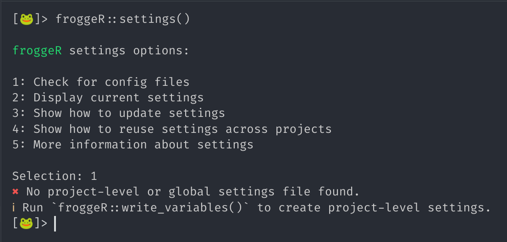
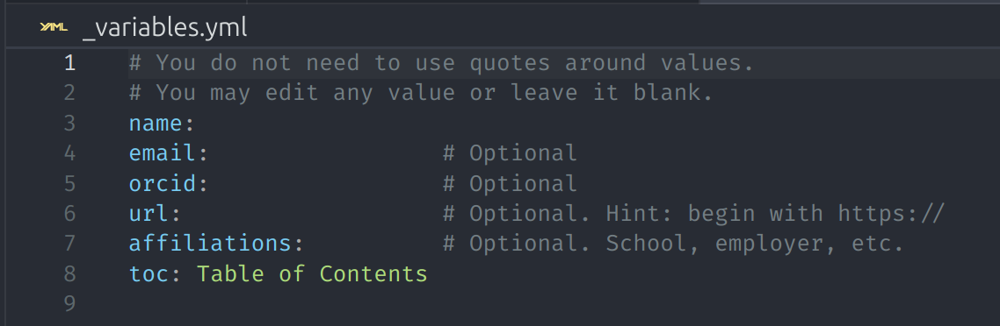
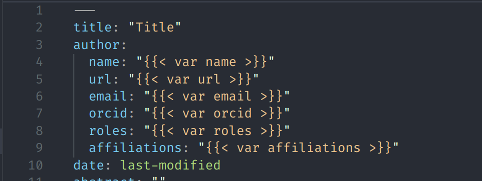
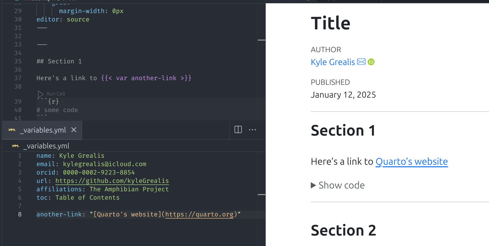

```{r, include = FALSE}
knitr::opts_chunk$set(
  collapse = TRUE,
  comment = "#>"
)
```

## Introduction

`froggeR` streamlines Quarto workflows by providing a robust, user-friendly framework for project setup and document creation. This vignette demonstrates how `froggeR` can enhance your productivity while maintaining project consistency.

```r
# Install from GitHub
remotes::install_github("kyleGrealis/froggeR")
```

----

## Core Features

Project setup often involves repetitive tasks that can impede your analysis workflow. `froggeR` addresses this by providing:

* Automated project initialization with [`quarto_project()`](https://kylegrealis.github.io/froggeR/reference/quarto_project.html)
* Reusable project configurations through [`settings()`](https://kylegrealis.github.io/froggeR/reference/froggeR_settings.html)
* Configurable document templates via [`write_quarto()`](https://kylegrealis.github.io/froggeR/reference/write_quarto.html)
* Consistent styling with [`write_scss()`](https://kylegrealis.github.io/froggeR/reference/write_scss.html)
* Enhanced version control setup
* Easily add project documentation templates to any existing project, even those not initialized by `froggeR`.

----

## SPOILER ALERT!!

All of the components listed below are available when you begin your Quarto projects with:

```r
froggeR::quarto_project()
```

Save time on building a project structure, formatting, and trying to redo that super awesome YAML you did a few weeks back. Start with `froggeR` now and get yourself dialed in for all future projects!

----

## Quick Start Guide

Create a new Quarto project with a single command:

```r
froggeR::quarto_project(name = "frogs")
```

This command initializes a complete project structure with all necessary components:

### Project Components

1. **Quarto Document** (`frogs.qmd`)
    * Pre-configured YAML header
    * Professional styling
    * Ready for immediate use

2. **Style Sheet** (`custom.scss`)
    * Modern design elements
    * Customizable components
    * Clear documentation

3. **Project Configuration**
    * `.Rproj` for RStudio integration
    * `_variables.yml` for consistent metadata
    * `.gitignore` for secure version control

When you start your first Quarto project with `froggeR`, you're choosing fast & efficient templating over tedious replication of project documents. `froggeR` provides the ability to create project-level metadata (stored in a `_variables.yml` file). This metadata populates certain fields in your Quarto document's YAML. For example, a `froggeR` Quarto document with the custom template displays "name" in the YAML as `name: "{}"`. However, when you render the document, the "name" value in the `_variables.yml` file populates this area and your actual name is displayed in the output. 

Now, this may seem arbitrary or too simplistic. Sure, but what if you would like to add an email hyperlink to your documents because your share the rendered HTML documents with your colleagues? That's simple -- just ensure that the "email" field has a value and that too will be displayed in the document too. The same applies for adding a personal or company URL, your ORCID link, a school or organization, or even a custom title for the table of contents. Since the `_variables.yml` file is composed of `key:value` pairs, fill in whichever values you would like to use, leave blank which ones you'd rather not, or *add* new `key:value` pairs.

> **Note**: It is strongly discouraged to delete any lines in the `_variables.yml` file as those are linked directly to the Quarto document. Either be sure to remove the `key:value` in the variables file **and** remove the `{{{ var [variable you want removed] }}}` from the Quarto template, or simply **just leave the value empty in the variables file**.

See `vignette("customizing-quarto", package = "froggeR")` for more detailed configuration options.

----

## Customization

### Document Settings

Manage your document settings with the interactive configuration tool (see `?froggeR::settings` for all options):

```{r, eval=FALSE}
# Check, display, or update your settings
froggeR::settings()
```

<div style="text-align: center;">
  <figure>
    
    <figcaption>froggeR settings menu</figcaption>
  </figure>
</div>

To create and open the `_variables.yml` file for immediate customization, run:

```{r, eval=FALSE}
# Create project-level metadata
froggeR::write_variables()
```
You will then see the file open with hints provided on how to fill in and use. Remember, it's better (and safer) to leave fields blank than to delete them... but you can remove the first two comment lines.

<div style="text-align: center;">
  <figure>
    
    <figcaption>Project variables file</figcaption>
  </figure>
</div>

If you would then like to reuse this file in future projects, run `froggeR::settings()` then choose option 4 "Show how to reuse settings across projects". An easier way is to just copy this to your console to save the `_variables.yml` in a system-level `froggeR` configuration file:

`file.copy(from = here::here("_variables.yml"), to = "~/.config/froggeR/config.yml")`

This will output `[1] TRUE` to the console indicating that the file copy worked. 

These settings flow through your projects in this order:

1. `config.yml` stores your permanent settings (exact location depends on your OS)
2. `froggeR` reads these when creating new projects
3. Settings populate `_variables.yml` in your project
4. Quarto documents use these variables automatically

<div style="text-align: center;">
  <figure>
    
    <figcaption>How froggeR manages settings across projects (config.yml)</figcaption>
  </figure>
</div>

<div style="text-align: center;">
  <figure>
    
    <figcaption>How froggeR manages settings across projects (_variables.yml)</figcaption>
  </figure>
</div>

> **Note:** While you can update these settings at any time, most users find they only need to set them once or very infrequently.

**Congratulations!** You've just made your next Quarto project with `froggeR` even easier! But how? Well, let's have a little fun: delete the `_variables.yml` in your local project you just created. Don't worry... we'll make it reappear, but this time you will not need to reinput the value fields. Once again, run `froggeR::write_variables()` and voila! You should see your saved config file that matches the one you just deleted... and it's already filled in!

This is `froggeR`'s main benefit: making Quarto documents and projects easier the next time too. Later we'll see how `froggeR::quarto_project()` will pull this information the next time while setting up the entire project structure. You can skip ahead to the <Quarto Workflow with froggeR> vignette, if you like.

### Create a Quarto document with a custom YAML

To further the leverage the power of project metadata, select a Quarto template with `custom_yaml = TRUE` (this is the default argument) and choose any name you'd like.

```{r, eval=FALSE}
# Create a new document using your settings
froggeR::write_quarto(
  filename = "analysis",
  custom_yaml = TRUE  # Use your configured settings
)
```

The template will open:

<div style="text-align: center;">
  <figure>
    
    <figcaption>Custom YAML template</figcaption>
  </figure>
</div>

If you're not familiar with this new structure in the YAML, that's ok. This is where the values from `_variables.yml` in the project links to the rendered document. The `{}` syntax imports the `name` value from the *var*iables metadata file. If you were to now make a second or third `froggeR::write_quarto()` document in this project, you will not need to manually enter your name and other details. These values will be automatically entered when you render the documents.

The `_variables.yml` metadata file is very versatile. You can include more `key:value` pairs to either the project- or global-level file(s) and those values will be accessible in any current or future documents. Imagine you had a second URL that you plan to use more than a few times in your Quarto document, and maybe you just don't want to type the long syntax over and over? Great, store it in the `_variables.yml` file... like this!

<div style="text-align: center;">
  <figure>
    
    <figcaption>Adding more key:values to project metadata</figcaption>
  </figure>
</div>

> **Note**: Wrap hyperlinks in quotes in the metadata file or the rendered output and link acts funky. Ask me how I know ;)

I'm sure you can envision many more ways to use metadata to your advantage. This isn't a "`froggeR`-thing"... the great team working on [Quarto](https://quarto.org) is to thank!

### Visual Styling

Customize your document appearance with SCSS:

```{r, eval=FALSE}
froggeR::write_scss()
```

This creates a `custom.scss` file with commented-out examples. Uncomment and modify these to customize your document's appearance. For more information on Quarto styling, refer to:

- [Quarto HTML Themes](https://quarto.org/docs/output-formats/html-themes.html)
- [Customizing Quarto Themes](https://quarto.org/docs/output-formats/html-themes.html#customizing-themes)

----

## Advanced Usage

### Project Documentation

Generate comprehensive project documentation:

```{r, eval=FALSE}
froggeR::write_readme()
froggeR::write_notes()
```

The README template was designed for academia in mind (notice the references to "PI", or principle investigator, within the file), but is adaptable to meet your needs. There are sections for explaining how to use your project, what the directories and files contain, and created so you can focus more on creating content.

We've included a `dated_progress_notes.md` file. A study with sample size *N=1* has demonstrated that this has really helped ~~me~~ the study participant refresh memory after a few weeks away from a project.

----

## Best Practices

For optimal results with `froggeR`:

1. **Use metadata in your projects**
    * Follow guide to save your metadata in the configuration file
    * Initialize projects with `quarto_project()` or `write_quarto()`
    * Review Quarto documentation to really open up your projects

1. **Project Organization**
    * Use consistent naming conventions
    * Maintain clear directory structure
    * Document project changes

1. **Version Control**
    * Review `.gitignore` settings
    * Update progress notes regularly
    * Maintain README documentation

1. **Styling**
    * Test SCSS changes before implementation
    * Document custom styling decisions
    * Use variables for consistency

----

## Troubleshooting and FAQs

### Common Issues

1. **Q: My YAML isn't rendering correctly in the Quarto document.**

   A: Ensure that your `_variables.yml` file is properly formatted. Check for any extra spaces or incorrect indentation.

2. **Q: The SCSS styles aren't applying to my document.**

   A: Make sure the SCSS file is properly linked in your YAML header. Remember, the order of the styles sheets matters. During the initialization of `froggeR::write_quarto(custom_yaml = TRUE)`, the `custom.scss` will override anything set in the `default` styling. The same applies if another SCSS sheet is added -- it will override all SCSS files listed above it. Check the console for any error messages during rendering.

3. **Q: I'm getting an error when trying to create a new project.**

   A: Ensure you have the latest version of froggeR and Quarto installed. Also, check if you have write permissions in the target directory.

### Tips for Smoother Projects

- Always review the generated files after project creation to ensure everything is set up as expected.
- When customizing SCSS, make small changes and render frequently to see the effects.
- Keep your froggeR settings up-to-date, especially when working across multiple projects.

For more specific issues, consult the documentation or reach out through the GitHub issue tracker.

----

## Getting Help

Need assistance? Several resources are available:

* Function documentation (e.g., `?write_quarto`)
* [GitHub repository](https://github.com/kyleGrealis/froggeR)
* Issue tracker for bug reports and feature requests
* See `vignette("customizing-quarto", package = "froggeR")` for styling details

----

## Future Developments

froggeR is continuously evolving to meet the needs of the R and Quarto community. Some exciting features on our roadmap include:

- **Quarto Dashboard Integration**: Streamlined creation and management of interactive Quarto dashboards.
- **Enhanced Version Control Integration**: More robust Git integration features.
- **Expanded Customization Options**: Additional templates and styling options for diverse project needs.
- **Collaborative Tools**: Features to enhance team workflows and project sharing.

Stay tuned to our GitHub repository for updates and new releases. We welcome feature requests and feedback from our user community to help shape the future of froggeR!

----

## Summary

`froggeR` provides a streamlined approach to Quarto project management, offering:

* Efficient project initialization
* Consistent document styling
* Secure version control
* Comprehensive documentation

Happy analyzing! 🐸

---

*Elevating your Quarto workflow with automated excellence*