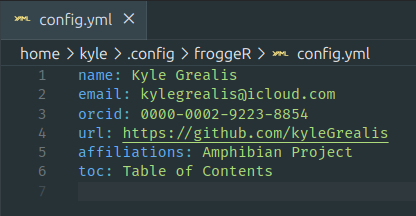
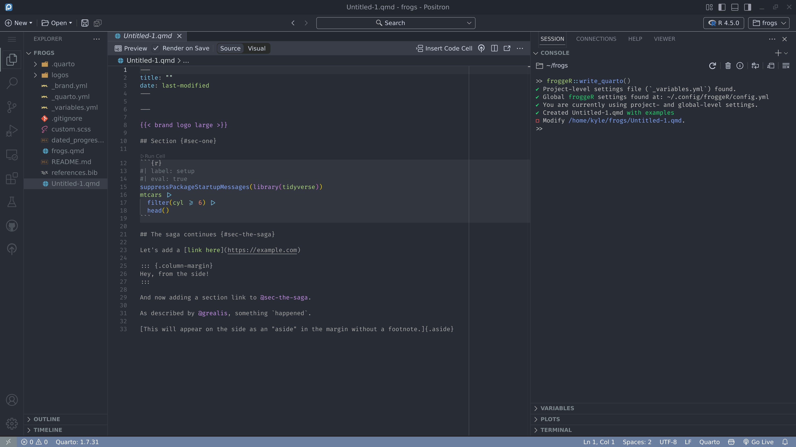

```{r, include = FALSE}
knitr::opts_chunk$set(
  collapse = TRUE,
  comment = "#>"
)
```

## Introduction

froggeR streamlines Quarto workflows by providing a robust, user-friendly framework for project setup and document creation. Leverage Quarto branding within your projects with froggeR's added functionality. This vignette demonstrates how froggeR can enhance your productivity while maintaining project consistency.

```r
# Install from GitHub
install.packages("kyleGrealis/froggeR")
```

----

## Core Features

Project setup often involves repetitive tasks that can impede your analysis workflow. froggeR addresses this by providing:

* Automated project initialization with [`quarto_project()`](https://www.kyleGrealis.com/froggeR/reference/quarto_project.html)
* Reusable project configurations through [`settings()`](https://www.kyleGrealis.com/froggeR/reference/froggeR_settings.html)
* Replicate Quarto project brand styling with [`write_brand()`](https://www.kyleGrealis.com/froggeR/reference/write_brand.html) and [`save_brand()`](https://www.kyleGrealis.com/froggeR/reference/save_brand.html)
* Configurable document templates via [`write_quarto()`](https://www.kyleGrealis.com/froggeR/reference/write_quarto.html)
* Consistent styling with [`write_scss()`](https://www.kyleGrealis.com/froggeR/reference/write_scss.html)
* Enhanced version control setup
* Easily add project documentation templates to any existing project, even those not initialized by froggeR.

----

## SPOILER ALERT!!

All of the components listed below are available when you begin your Quarto projects with:

```r
froggeR::quarto_project()
```

Save time on building a project structure, formatting, branding, and trying to redo that super awesome YAML you did a few weeks back. Start with froggeR now and get yourself dialed in for all future projects!

----

## Quick Start Guide

Create a new Quarto project with a single command:

```r
>> froggeR::quarto_project(name = "frogs")
This will create a new Quarto default project as a folder named frogs in
/home/kyle.
Do you want to proceed (Y/n)? 
Y
✔ Created Quarto project directory: frogs
✔ Created _quarto.yml
ℹ Copying existing froggeR settings...
✔ Created _variables.yml
ℹ Copying existing froggeR brand settings...
✔ Created _brand.yml
✔ Copying existing froggeR logos.
✔ Created custom.scss
✔ Created .gitignore
✔ Created README.md
✔ Created dated_progress_notes.md
✔ Created frogs.qmd with examples
✔ Created references.bib
✔ froggeR project setup complete. Opening in new session...
```

This command initializes a complete project structure with all necessary components:

### Project Components

1. **Quarto Document**
    * Pre-configured YAML header
    * Examples for adding brand logo, HTML in-document cross-references, and HTML links
    * Example for adding citations and references

2. **Style Sheet**
    * Modern design elements
    * Customizable components
    * Clear documentation

3. **Project Configuration**
    * `_quarto.yml` that is enhanced to simplify individual Quarto file YAML by centralizing document options. These can be changed on a per-document basis as well.
    * `_variables.yml` for consistent user metadata
    * `_brand.yml` for consistent project branding metadata
    * `.gitignore` for secure version control

When you start your first Quarto project with froggeR, you're choosing fast & efficient templating over tedious replication of project documents. froggeR provides the ability to create project-level metadata (stored in `_quarto.yml`, `_variables.yml`, and `_brand.yml` files). This metadata allows users to reproduce a consistent structure & style across many Quarto projects. The `_quarto.yml` file serves as a central project structure file where you can set project-level Quarto document defaults such as toggling familiar rendering settings (i.e., `format` options, `code-tools`, `page-layout`). 

You can then reuse personal metadata by modifying the `_variables.yml` file. These values are then used by `_quarto.yml` where the `name` value in `_variables.yml` is pulled into the project YAML as `name: ""`. When you render the document, your actual name is displayed in the output. Adding your email, a personal or company URL, or your ORCID is just the same -- the `_variables.yml` file is composed of `key:value` pairs. You can also create & use variables if you follow the format.

Now, this may seem like a lot of work for a basic Quarto project. You may be correct since the first project will take an extra few minutes of populating the `_variables.yml` file with your information and adjusting the `_quarto.yml` for project-level settings. However, once you `froggeR::save_variables()`, all of this work will be replicated immediately the *next* time you use froggeR to create your Quarto projects!

I'm sure you can envision many more ways to use metadata to your advantage. This isn't a "froggeR-thing"... the great team working on [Quarto](https://quarto.org) is to thank!

> **Note**: Deleting key:value pairs in the `_variables.yml` file requires you to also remove the corresponding fields in the `_quarto.yml`. It is recommended to comment out or leave blank the fields in `_variables.yml` that are not needed.

See `vignette("customizing-quarto", package = "froggeR")` for more detailed configuration options.

----

## Customization

### Document Settings

> You may choose to setup your froggeR metadata before creating your first project.

Manage your document settings with the interactive configuration tool (see `?froggeR::settings` for all options):

```r
# Check, display, or update your settings
>> froggeR::settings()

froggeR settings options: 

1: Check for config files
2: Display current settings
3: Show how to update settings
4: Show how to reuse settings across projects
5: More information about settings

Selection: 
1

ℹ Run froggeR::write_variables() to create project-level settings.
```

To create and open the `_variables.yml` file for immediate customization, run:

```r
# Create project-level metadata
froggeR::write_variables()
```

You will then see the file open with hints provided on how to fill in and use. Remember, it's better (and safer) to leave fields blank than to delete them... but you can remove the first two comment lines.

```r
# You do not need to use quotes around values.
# You may edit any value or leave it blank.
name: 
email: 
orcid: 
url: #https://example.com
affiliations: 
```

Save this file then run `froggeR::save_variables()` to store this configuration file in your operating system's (OS) configuration file location (i.e., in Linux, this is `$HOME/.config/froggeR/config.yml`). This reinforces froggeR's goal to increase your effeciency now and for future projects.

These settings flow through your projects in this order:

1. `config.yml` stores your permanent settings (exact location depends on your OS)
2. froggeR reads these when creating new projects
3. Settings populate `_variables.yml` in your project
4. Quarto documents use these variables automatically

<div style="text-align: center;">
  <figure>
    
    <figcaption>How froggeR manages settings across projects (config.yml)</figcaption>
  </figure>
</div>

> **Note:** While you can update these settings at any time, most users find they only need to set them once or very infrequently.

**Congratulations!** You've just made your next Quarto project with froggeR even easier! But how? Well, let's have a little fun: delete the `_variables.yml` in your **local** project you just created. Don't worry... we'll make it reappear, but this time you will not need to reinput the value fields. Once again, run `froggeR::write_variables()` and voila! You should see your saved config file that matches the one you just deleted... and it's already filled in!

This is froggeR's main benefit: making Quarto documents and projects easier the next time too. Later we'll see how `froggeR::quarto_project()` will pull this information the next time while setting up the entire project structure. You can skip ahead to the <Quarto Workflow with froggeR> vignette, if you like.


### Create a Quarto document with examples

Quickly create a Quarto document that includes examples for adding your brand logo, section and other within-document cross-references, hyperlinks, and references with `froggeR::write_quarto(example = TRUE)`. This opens a new file with the default name of "Untitled-1.qmd".


The template will open:

<div style="text-align: center;">
  <figure>
    
    <figcaption>Quarto template with examples</figcaption>
  </figure>
</div>


### Visual Styling

Customize your document appearance with SCSS:

```r
froggeR::write_scss()
```

This creates a `custom.scss` file with commented-out examples. Uncomment and modify these to customize your document's appearance. For more information on Quarto styling, refer to:

- [Quarto HTML Themes](https://quarto.org/docs/output-formats/html-themes.html)
- [Customizing Quarto Themes](https://quarto.org/docs/output-formats/html-themes.html#customizing-themes)

----

## Advanced Usage

### Project Documentation

Generate comprehensive project documentation:

```{r, eval=FALSE}
froggeR::write_readme()
froggeR::write_notes()
```

The README template was designed for academia in mind (notice the references to "PI", or principle investigator, within the file), but is adaptable to meet your needs. There are sections for explaining how to use your project, what the directories and files contain, and created so you can focus more on creating content.

We've included a `dated_progress_notes.md` file. A study with sample size *N=1* has demonstrated that this has really helped ~~me~~ the study participant refresh memory after a few weeks away from a project.

----

## Best Practices

For optimal results with froggeR:

1. **Use metadata in your projects**
    * Follow guide to save your metadata in the configuration file
    * Initialize projects with `quarto_project()` or `write_quarto()`
    * Review Quarto documentation to really open up your projects

1. **Project Organization**
    * Use consistent naming conventions
    * Maintain clear directory structure
    * Document project changes

1. **Version Control**
    * Review `.gitignore` settings
    * Update progress notes regularly
    * Maintain README documentation

1. **Styling**
    * Test SCSS changes before implementation
    * Document custom styling decisions
    * Use variables for consistency

----

## Troubleshooting and FAQs

### Common Issues

1. **Q: My YAML isn't rendering correctly in the Quarto document.**

   A: Ensure that your `_variables.yml` file is properly formatted. Check for any extra spaces or incorrect indentation.

2. **Q: The SCSS styles aren't applying to my document.**

   A: Make sure the SCSS file is properly linked in your YAML header. Remember, the order of the styles sheets matters. During the initialization of `froggeR::write_quarto(custom_yaml = TRUE)`, the `custom.scss` will override anything set in the `default` styling. The same applies if another SCSS sheet is added -- it will override all SCSS files listed above it. Check the console for any error messages during rendering.

3. **Q: I'm getting an error when trying to create a new project.**

   A: Ensure you have the latest version of froggeR and Quarto installed. Also, check if you have write permissions in the target directory.

### Tips for Smoother Projects

- Always review the generated files after project creation to ensure everything is set up as expected.
- When customizing SCSS, make small changes and render frequently to see the effects.
- Keep your froggeR settings up-to-date, especially when working across multiple projects.

For more specific issues, consult the documentation or reach out through the GitHub issue tracker.

----

## Getting Help

Need assistance? Several resources are available:

* Function documentation (e.g., `?write_quarto`)
* [GitHub repository](https://github.com/kyleGrealis/froggeR)
* Issue tracker for bug reports and feature requests
* See `vignette("customizing-quarto", package = "froggeR")` for styling details

----

## Future Developments

froggeR is continuously evolving to meet the needs of the R and Quarto community. Some exciting features on our roadmap include:

- **Quarto Dashboard Integration**: Streamlined creation and management of interactive Quarto dashboards.
- **Enhanced Version Control Integration**: More robust Git integration features.
- **Expanded Customization Options**: Additional templates and styling options for diverse project needs.
- **Collaborative Tools**: Features to enhance team workflows and project sharing.

Stay tuned to our GitHub repository for updates and new releases. We welcome feature requests and feedback from our user community to help shape the future of froggeR!

----

## Summary

froggeR provides a streamlined approach to Quarto project management, offering:

* Efficient project initialization
* Consistent document styling
* Secure version control
* Comprehensive documentation

Happy analyzing! 🐸

---

*Elevating your Quarto workflow with automated excellence*