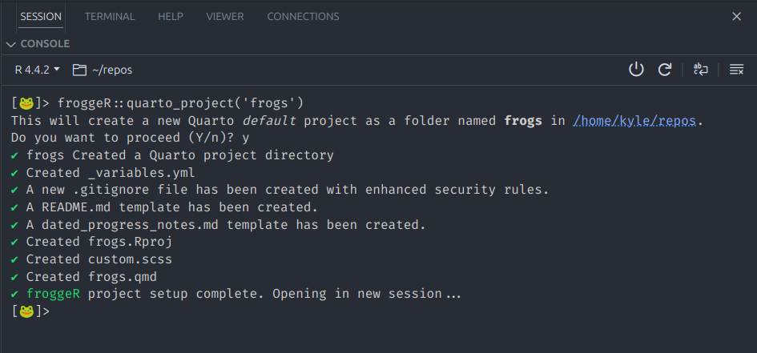
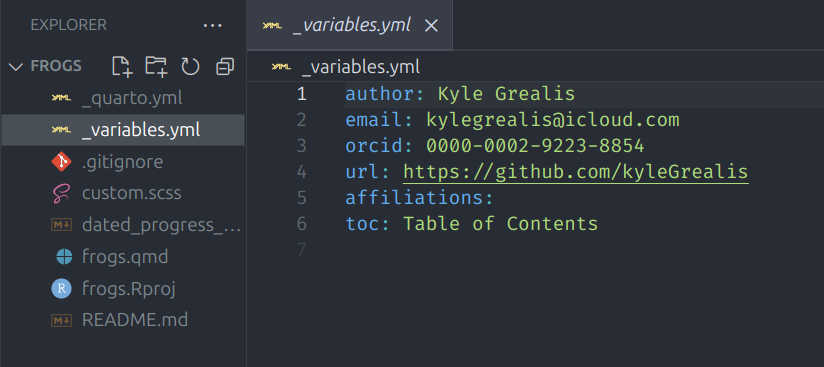
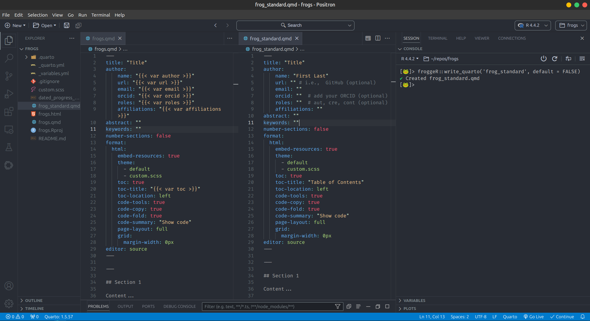

```{r, include = FALSE}
knitr::opts_chunk$set(
  collapse = TRUE,
  comment = "#>"
)
```

## Introduction 🐸

`froggeR` streamlines your Quarto workflow by providing two powerful functions: [`quarto_project()`](https://kylegrealis.github.io/froggeR/reference/quarto_project.html) for complete project initialization and [`write_quarto()`](https://kylegrealis.github.io/froggeR/reference/write_quarto.html) for individual document creation. This vignette demonstrates how to use these functions effectively and how they work together.

----

## Project Creation

### Complete Project Setup

The quickest way to start a new Quarto project:

```r
froggeR::quarto_project(name = "frogs")
```

This single command creates a complete project structure:

```{r, echo=FALSE, fig.align='center', fig.cap='Project initialization example', out.width='70%'}

```


```{r, echo=FALSE, fig.align='center', fig.cap='Project directory structure example', out.width='70%'}

```

Your new project includes:

| Component | Description |
|-----------|-------------|
| `frogs/` | Main project directory |
| `frogs.qmd` | Main Quarto document |
| `frogs.Rproj` | RStudio project file |
| `_variables.yml` | Reusable document settings |
| `custom.scss` | Style sheet template |
| `README.md` | Project documentation |
| `.gitignore` | Enhanced security settings |

### Understanding Project Components

Each component serves a specific purpose:

1. **Quarto Document** (`frogs.qmd`)
    * Pre-configured YAML header
    * Links to your styling
    * Ready for content

2. **Project Settings** (`_variables.yml`)

    ```yaml
    author: Your Name
    email: your.email@example.com
    affiliations: Your Institution
    ```

> **Note:** These values come from your `froggeR_settings()`

3. **Style Sheet** (`custom.scss`)
    * Professional defaults
    * Customizable elements
    * Clear documentation

```{r, echo=FALSE, fig.align='center', fig.cap='Integrated YAML structure example', out.width='70%'}

```

----

## Individual Document Creation

### Basic Document

Create a new Quarto document in an existing project:

```r
froggeR::write_quarto(
  filename = "frog_analysis",
  default = TRUE  # Use settings from _variables.yml
)
```

This creates `frog_analysis.qmd` with:

* Formatted YAML header
* Two starter sections
* Links to project styling

### Custom Documents

For documents without project settings and requiring manual changes to the document YAML:

```r
froggeR::write_quarto(
  filename = "frog_standalone",
  default = FALSE  # Basic Quarto template
)
```

### Document Types

`write_quarto()` supports two main workflows:

1. **Project Documents** (`default = TRUE`)
    * Use project settings
    * Include custom styling
    * Maintain consistency

2. **Standalone Documents** (`default = FALSE`)
    * Basic Quarto template
    * No external dependencies
    * Quick start for simple docs

```{r, echo=FALSE, fig.align='center', fig.cap='Comparison of document types', out.width='85%'}

```

The `default = TRUE` template leverages your project's `_variables.yml` settings, automatically populating author information, styling, and other metadata. This means you can focus immediately on content creation rather than document setup. Conversely, `default = FALSE` provides a minimal template when you need a standalone document without project-specific configurations.

----

## Rendered Output

```{r, echo=FALSE, fig.align='center', fig.cap='Example output of "default" document', out.width='85%'}
knitr::include_graphics("../man/figures/rendered_doc.png")
```

----

## Workflow Integration

### Project-Level Workflow

Best practices for project organization:

1. **Initial Setup**

    ```r
    # Create new project
    froggeR::quarto_project(name = "frogs")
    ```

    Recommended project structure:

    | Directory/File | Purpose | Contents |
    |----------------|---------|-----------|
    | `data/` | Raw data storage | Input files, datasets |
    | `output/` | Analysis results | Figures, tables, exports |
    | `R/` | Custom functions | R scripts, utilities |
    | `docs/` | Documentation | Additional guides, notes |
    | `*.qmd` | Analysis documents | Main content and code |

2. **Additional Documents**

    ```r
    # Add analysis documents
    froggeR::write_quarto(
      filename = "data_prep",
      default = TRUE
    )
    
    froggeR::write_quarto(
      filename = "analysis",
      default = TRUE
    )
    ```

3. **Project Structure**

    ```
    frogs/
    ├── frogs.qmd
    ├── data_prep.qmd
    ├── analysis.qmd
    ├── _variables.yml
    ├── custom.scss
    └── README.md
    ```

### Document Management

Tips for effective document organization:

1. **Consistent Naming**
    * Use descriptive filenames
    * Follow a naming convention
    * Consider document order

2. **Settings Management**
    * Keep `_variables.yml` updated
    * Maintain consistent styling
    * Document customizations

3. **Version Control**
    * Commit regularly
    * Update README
    * Track progress

Common `.gitignore` patterns:

| Pattern | Excludes | Why |
|---------|----------|-----|
| `*.rds` | R data files | Data security |
| `.Rhistory` | R history files | Session cleanup |
| `output/` | Generated files | Avoid tracking outputs |
| `*.html` | Rendered documents | Focus on source files |

----

## Common Customizations

### Project Modifications

Customize your project structure:

```r
froggeR::quarto_project(
  name = "advanced_frogs",
  default = TRUE  # Include all styling options
)
```

Then add specialized documents:

```r
# Data preparation
froggeR::write_quarto(filename = "01_data_prep")

# Analysis
froggeR::write_quarto(filename = "02_analysis")

# Results
froggeR::write_quarto(filename = "03_results")
```

> **Note:** When working in a `froggeR` project, `write_quarto()` automatically uses your project's `_variables.yml` settings by default, ensuring consistent styling and metadata across all documents.

### Document Customization

Modify individual documents while maintaining project consistency:

1. **YAML Additions**

    ```yaml
    ---
    title: "Analysis Results"
    author: ""
    date: last-modified
    format:
      html:
        code-fold: true
        toc: true
    ---
    ```

2. **Style Variations**
    * Create additional SCSS files
    * Modify existing styles
    * Add document-specific rules

----

## Troubleshooting

Common issues and solutions:

1. **Project Creation Issues**
    * Verify directory permissions
    * Check for existing projects
    * Ensure valid project name

2. **Document Problems**
    * Confirm `_variables.yml` exists
    * Check YAML syntax
    * Verify file locations

3. **Style Integration**
    * Review SCSS references
    * Check file paths
    * Validate YAML structure

----

## Additional Resources

For more information on:

* Quarto documents: `vignette("customizing-quarto", package = "froggeR")`
* Project styling: See `?write_scss`
* Settings management: See `?froggeR_settings`

----

## Summary

`froggeR`'s project workflow provides:

* Efficient project initialization
* Consistent document creation
* Integrated styling
* Automated setup
* Professional templates

Happy documenting! 🐸

---

*Streamlined Quarto workflows with automated excellence*